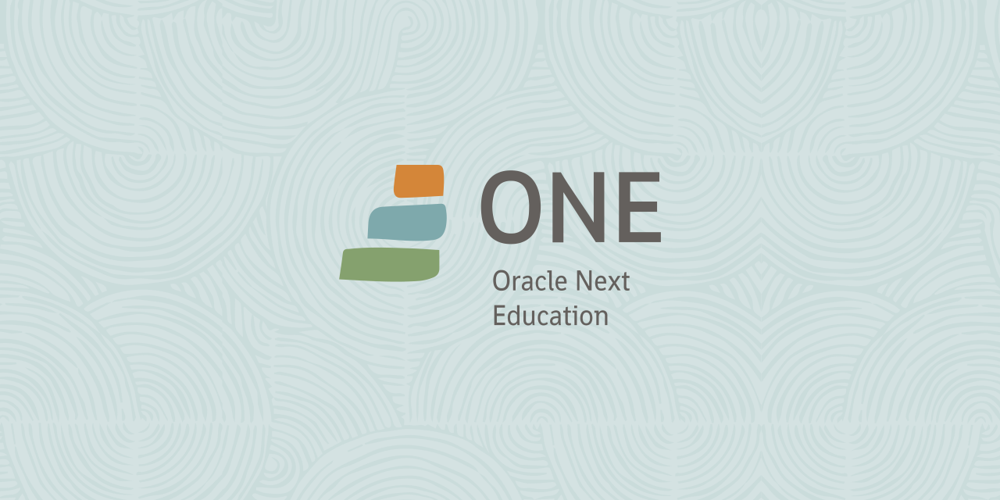

 <strong><h2 align="center">Trilhas</h2></strong>

### Iniciante em programação 

#### Aprender a lógica de programação:white_check_mark:

- Lógica de programação I:heavy_check_mark:
- Lógica de programação II:heavy_check_mark:

#### Criar suas primeiras páginas web

- HTML 5 e CSS3 parte 1: crie uma página da Web:heavy_check_mark:

- HTML 5 e CSS3 parte 2: posicionamento, lista e navegação:heavy_check_mark:

- HTML 5 e CSS3 parte 3: trabalhando com formulários e tabelas:heavy_check_mark:

- HTML 5 e CSS3 parte 4: avançado no CSS:heavy_check_mark:

#### Ganhar experiência com o Git:white_check_mark:

- Git e GitHub: controle e compartilha seu código:heavy_check_mark:

